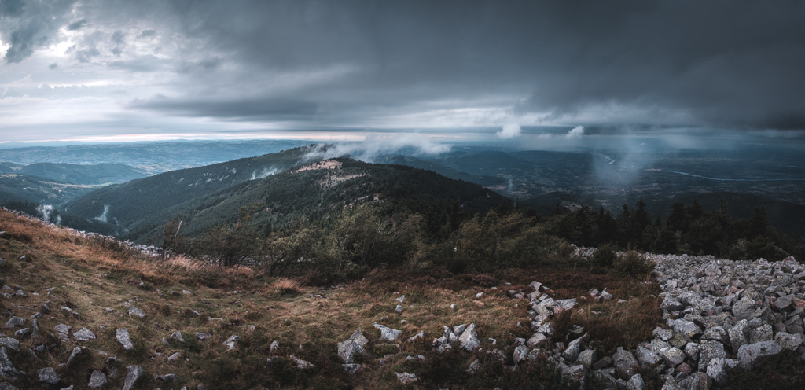
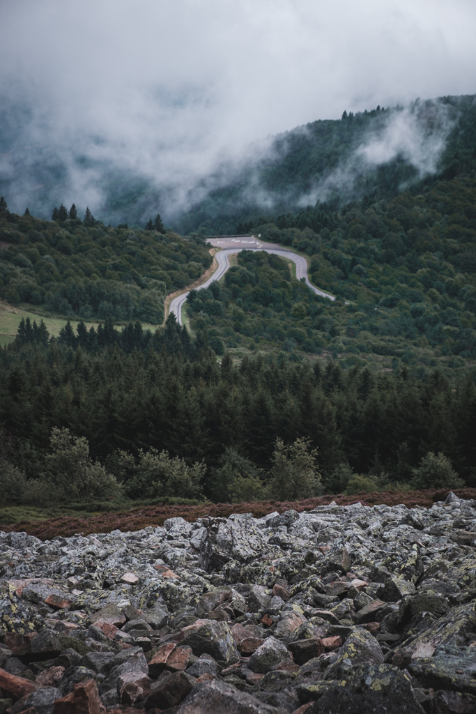
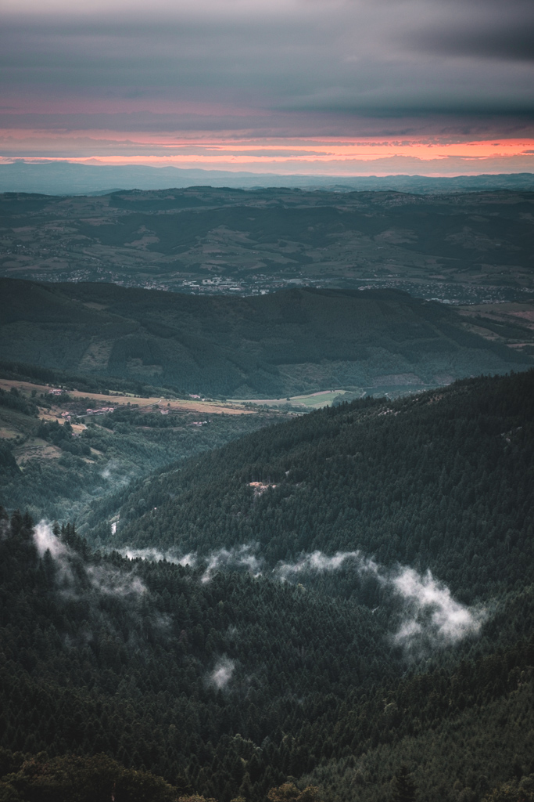
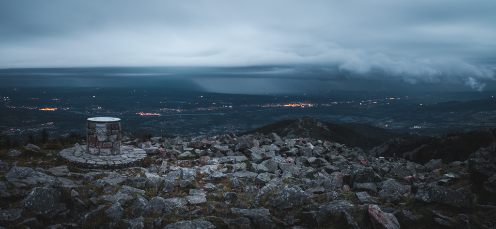
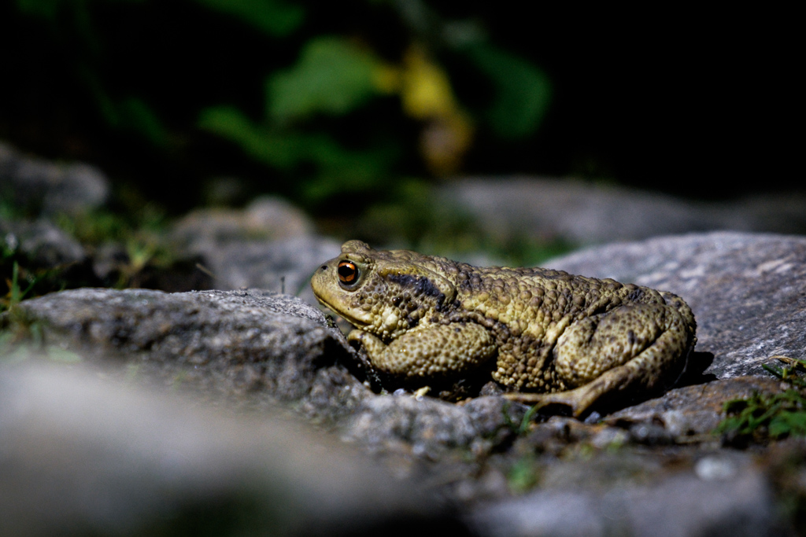

A friend of mine wanted to shoot the Milky Way, so I started looking for a date on which conditions would be fine (no moon and clear sky), as well as a nice location.

We settled on the summit of the Mont Pilat, south of Lyon, France. This is a location we have known for a while now, since our childhood, but we haven't came back there recently and I had never shot it since my return in France.

Unfortunately, the week before the day, forecasting changed and thunderstorms were expected. It was then confirmed, but we decided to go anyway, knowing the Milky Way will not be visible because of the bad weather.

<photo-list>

</photo-list>

It was a good call actually, the view of the landscape covered in clouds was impressive. Even if the sunset color was distant and the thunder was really far, it still gave an interesting look to the scene.

Maybe the next time we'll be able to proceed as planned !

We even had some company :

