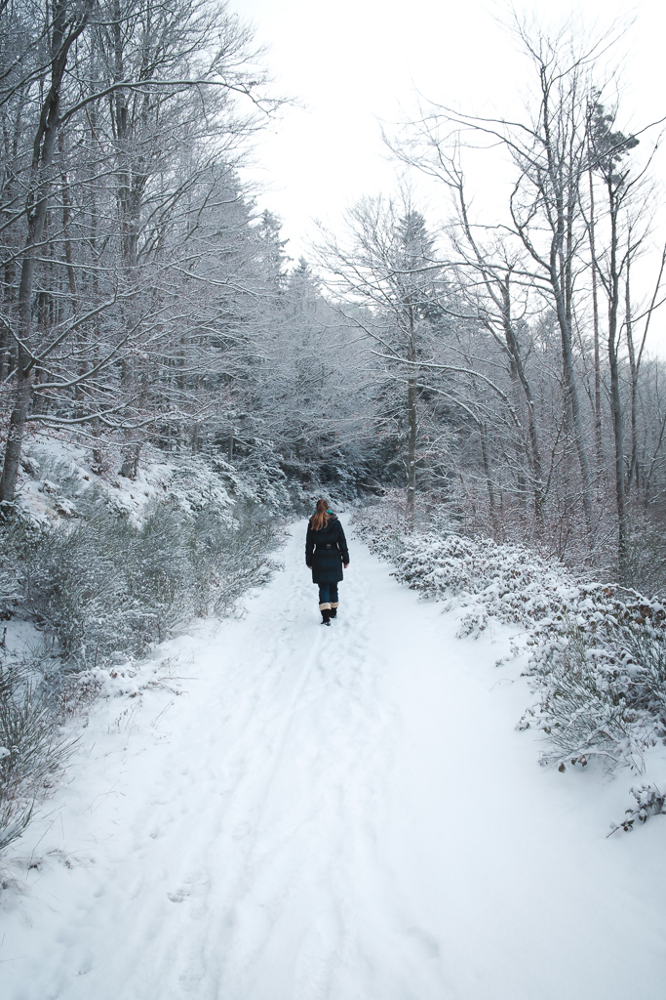
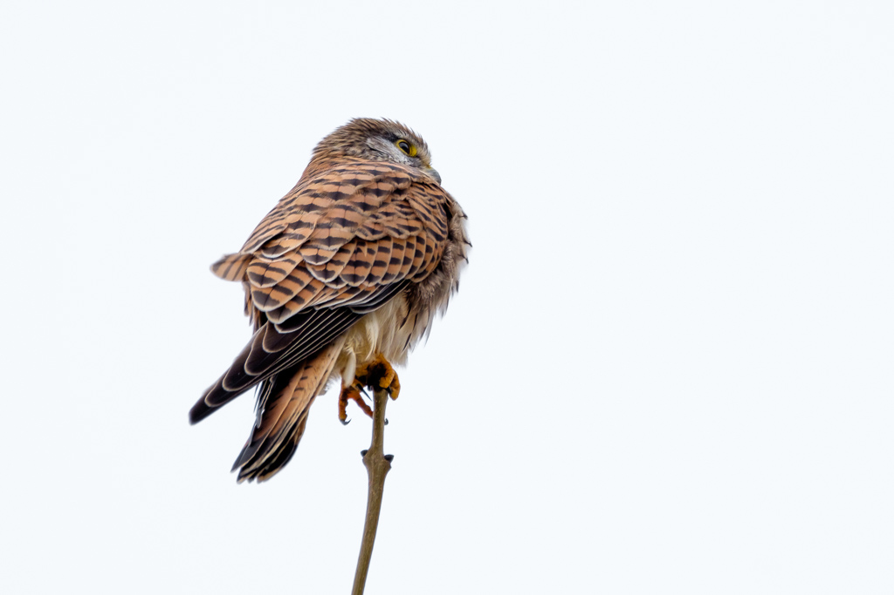

Sadly, I missed the first snow which fell on the Pilat mounts, next to my home.

As it melted pretty fast, I had to wait for the second snow fall, which fortunately happend on a friday, giving me the opportunity to come see it on saturday.

<photo-list>

</photo-list>

The forest was beautiful, partly covered in snow and hidden in the cloud.
All these elements added interesting layers to the scene :

<photo-list>

</photo-list>

There were also many natural textures in the "chirats", those rock formations typical to the region :

By the way, below is my first correct photo of a kestrel falcon, found next to the road. As it quickly moved away, I wasn't able to find a better angle with a proper background instead of this uniform boring sky.

