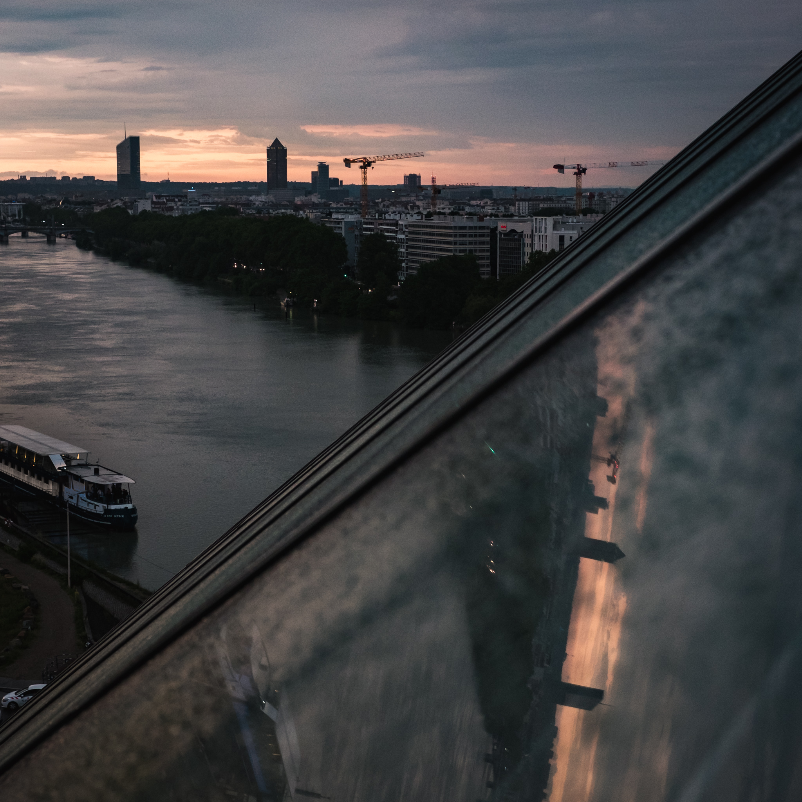

Bien qu'amateur de bandes dessinées, je n'ai jamais lu un seul album de Corto Maltese... Mais quand [Onlylyon](http://www.onlylyon.com/) m'invite au Musée des Confluences pour une visite guidée de l'exposition temporaire "Hugo Pratt, lignes d'horizons", je n'hésite pas en me disant que c'est le moment d'en savoir plus sur cet auteur emblématique et son personnage phare !

L'exposition commence par une biographie de l'auteur, un rappel sur ses débuts et ses motivations, son goût du voyage et de la découverte.

La suite se concentre sur les cultures mises en avant dans l'oeuvre d'Hugo Pratt, et la façon dont elles intéragissent avec ses personnages.

De nombreuses planches sont imprimées en très grand format, plongeant l'exposition dans une ambiance très particulière.

Une table interactive et ludique au centre de l'exposition permet d'en savoir plus sur certains des personnages rencontrés par Corto Maltese.

Les visiteurs sont ensuite guidés vers la partie de l'exposition concernée. Dans chaque section, des objets sont présentés pour illustrer le personnage et sa culture, certains ayant appartenu à Hugo Pratt.

<photo-list>

</photo-list>

A la toute fin, de superbes animations compilant les oeuvres de Pratt sont projetées dans une salle circulaire. Je ne vous gâche pas la surprise en vous montrant des photos, car ça vaut vraiment la peine d'en profiter sur place :)

La visite s'est terminée sur le toit du musée, qui offre un beau panorama sur Lyon et qui permet parfois d'observer d'impressionants coucher de soleil, mais pas cette fois-ci à cause des très nombreux nuages...

<photo-list>

</photo-list>