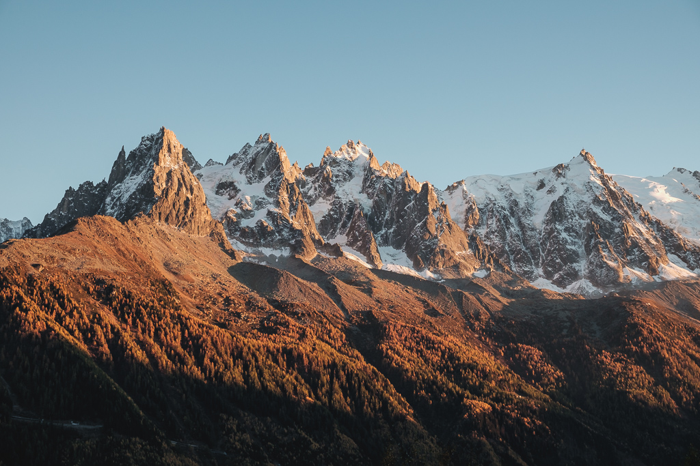

We drove early to Chamonix to meet up with our friends and start a small hike in the mountains. The goal was to enjoy the autumn colors on one of the last sunny and hot day of the year before the snow and the cold fall on the Alps.

We settled on the hike to the Lac Blanc (White Lake), because of the beautiful view of the Mont-Blanc and the other peaks and summits, right across the Chamonix valley.

The morning light was wonderful. I almost had tears when we entered in the Arve valley, from where you can see the Mont-Blanc and the sun hitting the autumnal trees.

<photo-list>

</photo-list>

The cable car, which starts from the valley (1060m) and goes up to the Flagère station (1894m) was closed, so we did this part by foot.

It was still cold in the forest, but we warmed up quickly as we walked.

The station was deserted, except for some other hikers who seemed to be on their way to the Lac Blanc too.

<photo-list>

</photo-list>

From there, the path was free from trees and we had the view on all the valley and the mountains.

<photo-list>

</photo-list>

My hope for the day was to observe some wildlife and shoot their picture. To my knowledge, there are some bearded vultures, the largest bird of all Europe, in the Chamonix valley.

I would have love to at least have a look of them, but unfortunately, we only saw what we call a "chocard à bec jaune" (Alpine chough), a mid-size bird, not afraid to come near hikers, who was still very interesting.

We finally arrived to the Lac Blanc after more than 5 hours hiking. The view from there is quite enjoyable, despite the light being a little flat yet.

There was a lot of people up there, some of them who were camping for the night. Next time I think we will do the same, and enjoy the sun sets and rises behind the mountains

The return trip was hard for the knees, but the light started to become really interesting, and despite the lack of cloud to give dramatic atmosphere, we had amazing views of the peaks through the holes in the trees.

Below is a series of the same peaks, shot as we went down the path back to the car.

<photo-list>

</photo-list>

We finished the hike at night, without problem thanks to our lights (always pack one in your bag !). Tired and exhausted, the tartiflette and fondue were even better !

No photo of these however, we were too hungry ;) .

